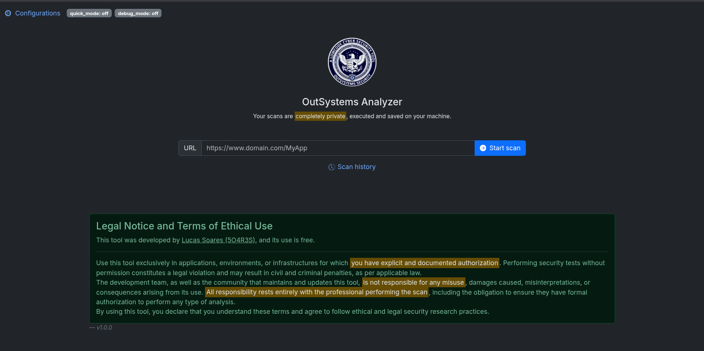
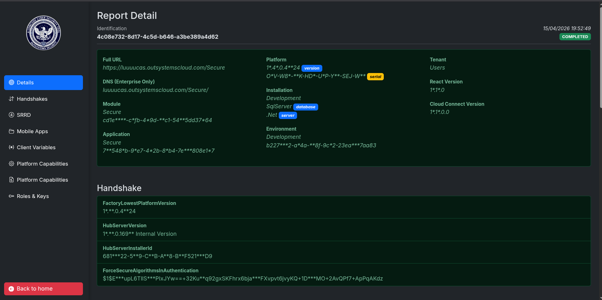
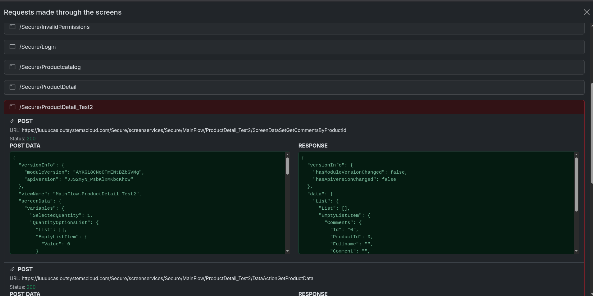
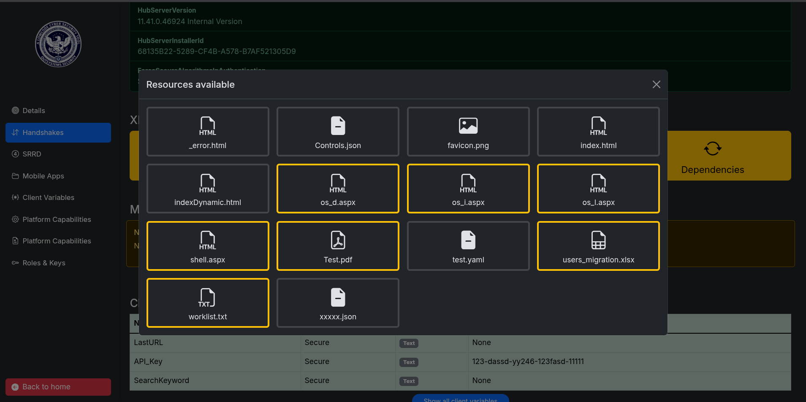
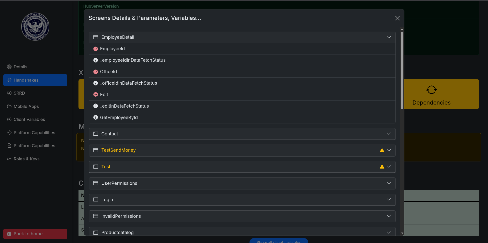

# OutSystems Analyzer 🔍

[](https://www.python.org/downloads/)
[](LICENSE)
[](#-installation--setup)

**OutSystems Analyzer** is a specialized reconnaissance and security analysis tool designed for OutSystems React Web applications. It automates metadata collection, screen mapping, and the identification of exposed client variables and environment configurations and much more, providing a structured report for security researchers and penetration testers.

---

## 🤝 Community & Support

This tool is designed to provide technical insights into OutSystems applications. If you are a customer and find vulnerabilities or need expert guidance on how to remediate identified risks:

* **Expert Assistance:** Please consider reaching out to an [OutSystems MVP](https://www.outsystems.com/community/mvps/) member. They are recognized experts who can provide high-level architectural and security advice.
* **Contributions:** If you have suggestions or found a bug in the analyzer, feel free to open an **Issue** or a **Pull Request**.

---

## ⚠️ Legal Disclaimer

**This tool is for educational and professional security auditing purposes only.** Unauthorized access to systems without explicit written consent is illegal. The developer assumes no liability and is not responsible for any misuse or damage caused by this tool. Usage must be compliant with local laws and ethical hacking standards.

---

## ✨ Key Features

* **Endpoint & Screen Mapping:** Automatically discovers application screens, identifies suspicious or hidden paths, and performs **Deep Screen Inspection** to extract granular metadata.
* **Request & Response Analysis:** Provides a per-screen breakdown of network calls, detailing request structures and server responses for thorough vulnerability assessment.
* **Screendetails & DOM Insights:** Maps technical details of every screen, providing a deep dive into the application's structure and UI logic.
* **Metadata & Secret Extraction:** Scans `Client Variables` to identify sensitive data leaks and potential hardcoded secrets or API keys.
* **Dependency & Module Mapping:** Maps all dependent modules and shared libraries required for the application to function, revealing the internal architecture and ecosystem.
* **Public Resource Discovery:** Scans and catalogs public files, assets, and resources located in the root directory.
* **Role-Based Access (RBAC) Profiling:** Identifies defined **User Roles** and permissions associated with the application's security logic.
* **Platform Profiling:** Detects OutSystems platform capabilities, runtime versions, and environment-specific configurations.
* **Interactive Web Dashboard:** A professional Bootstrap-based interface for centralized report management, data filtering, and advanced security analysis.
* **Optimized Execution Modes:** Support for **Quick Scan** (fast reconnaissance) and **Debug Mode** (full forensic depth).

---

## 📸 Screenshots

### Main


### Dashboard


### Requests and Responses


### Resources


### Screens Details


---

## 🚀 Installation & Setup

The analyzer is cross-platform and requires **Python 3.9+**.

### 1. Clone the repository
```bash
git clone [https://github.com/5O4R3S/outsystems-analyzer.git](https://github.com/5O4R3S/outsystems-analyzer.git)
cd outsystems-analyzer


## 🛠️ Usage LINUX / MacOS
# Grant execution permissions
chmod +x setup.sh run.sh

# Initial setup (creates venv and installs requirements)
./setup.sh

# Launch the application
./run.sh

## 🛠️ Usage WINDOWS
# Create a virtual environment
python -m venv OSANALYZER

# Activate the environment
# In PowerShell:
.\OSANALYZER\Scripts\Activate.ps1
# In CMD:
.\OSANALYZER\Scripts\activate.bat

# Install dependencies
pip install -r requirements.txt

# Launch the application
python main.py
